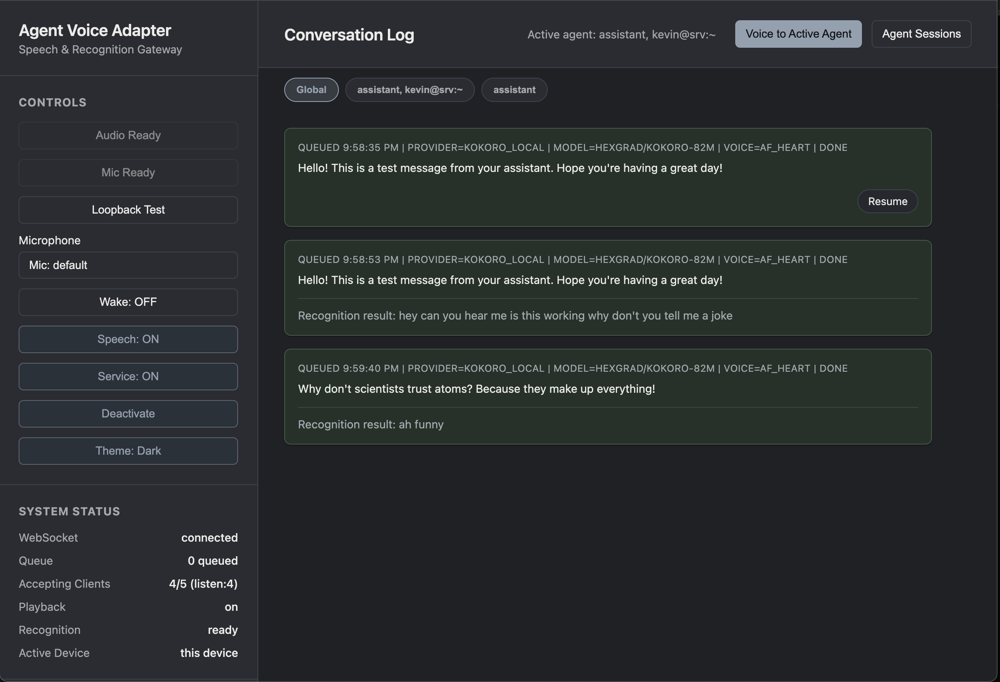
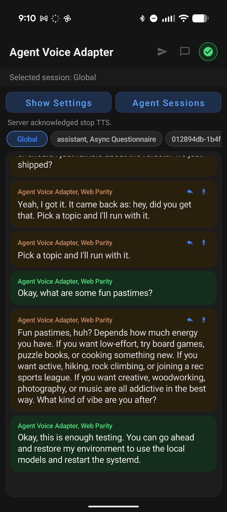
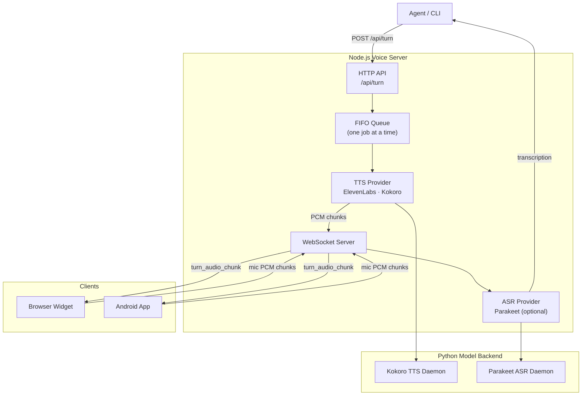
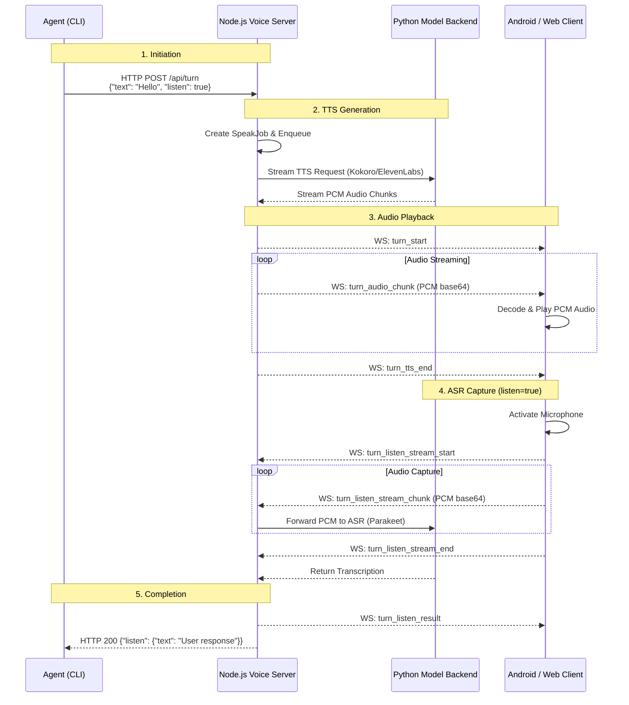

# agent-voice-adapter

> **Experimental Notice** — This is experimental personal software, shared for educational purposes.

A local Node.js + TypeScript application that bridges agent output to voice interaction. Use queued turn-mode requests via `POST /api/turn`, or explicit-target direct-media requests via `/api/media/*`, to drive streamed TTS and speech recognition across browser, Android, and CLI clients.

### Screenshots

<table>
  <tr>
    <td valign="top"></td>
    <td valign="top"></td>
  </tr>
</table>

## Table of Contents

- [How It Works](#how-it-works)
- [Quick Start](#quick-start)
- [Architecture](#architecture)
- [Configuration](#configuration)
- [API Reference](#api-reference)
- [WebSocket Protocol](#websocket-protocol)
- [CLI](#cli)
- [Web Widget](#web-widget)
- [Android Client](#android-client)
- [Deployment](#deployment)
- [Troubleshooting](#troubleshooting)
- [Project Structure](#project-structure)
- [Development](#development)
- [License](#license)

## How It Works



1. Client submits text to `POST /api/turn`.
2. Server sanitizes text and enqueues the request in a FIFO queue.
3. Queue processor runs one request at a time:
   - TTS generation streams PCM chunks to the turn owner client via WebSocket.
   - For `listen=false`, queue advances after the client sends a playback-terminal ack.
   - For `listen=true`, the queue slot stays active through recognition completion.
4. When recognition is requested (`listen=true`):
   - Turn owner captures mic PCM and streams it back over WebSocket.
   - ASR provider produces a terminal result (success, timeout, no-response, or canceled).
   - After terminal state, queue advancement waits `WAIT_FOR_RECOGNITION_QUEUE_ADVANCE_DELAY_MS` (default 2000ms) before the next request.

This preserves deterministic end-to-end ordering across TTS and recognition, prevents overlap between queued recognition turns, and keeps caller behavior predictable.

The server exposes two complementary API families:

- Turn mode: queued, owner-routed `POST /api/turn` requests with optional post-playback recognition.
- Direct media: non-turn, explicit-target `/api/media/*` requests plus `media_*` websocket messages for direct TTS and STT.

## Quick Start

### Prerequisites

- **Node.js 20+**
- Two API keys for the default (no-GPU) hosted setup:
  - **ElevenLabs** for TTS
  - **OpenAI** for ASR (Whisper / `gpt-4o-mini-transcribe`)

If you prefer self-hosted inference instead of hosted APIs, see [Local Python Models](#local-python-models-alternative) below.

### Setup (recommended: hosted ElevenLabs TTS + OpenAI Whisper ASR)

The repo ships [`agent-voice-adapter.json`](agent-voice-adapter.json) pre-wired for this path — just drop in your two keys and go.

```bash
cd /path/to/agent-voice-adapter
npm install

# Edit agent-voice-adapter.json and replace:
#   "REPLACE_WITH_ELEVENLABS_API_KEY" -> your ElevenLabs API key
#   "REPLACE_WITH_OPENAI_API_KEY"     -> your OpenAI API key
# (You can also inject them via env vars: ELEVENLABS_API_KEY and OPENAI_API_KEY
#  take precedence over JSON values, useful for systemd Environment= drop-ins.)

npm run dev
```

Open `http://localhost:4300`:
1. Click `Enable Audio` (browser permission/init).
2. Keep `Service: ON` so `/api/turn` requests are accepted.
3. Optional: switch `Speech: OFF` for text-only bubbles.

### Local Python Models (alternative)

If you have a GPU and want to avoid per-call hosted costs, switch the providers to `kokoro_local` + `parakeet_local` in `agent-voice-adapter.json` and follow the full venv / package / model setup in [docs/python-local-models-setup.md](docs/python-local-models-setup.md). That doc covers Python venvs, pinned package versions for the `kokoro` and `nemo_toolkit[asr]` stacks, the `ffmpeg` system dependency, and model download behavior.

## Architecture

### Turn Lifecycle



### Core Components

| Component | Path | Purpose |
|-----------|------|---------|
| HTTP + WebSocket server | `src/server/server.ts` | Request handling, job queue, state management |
| TTS provider abstraction | `src/server/ttsProvider.ts` | Factory for ElevenLabs / Kokoro clients |
| ASR provider abstraction | `src/server/asrProvider.ts` | Factory for Parakeet client |
| Configuration | `src/server/config.ts` | ENV + JSON config merging with validation |
| Text sanitization | `src/server/sanitizeText.ts` | Strip markdown, backticks, URLs before TTS |
| WebSocket protocol | `src/server/wsInboundProtocol.ts` | Client message parsing and type guards |
| Wake intent handler | `src/server/wakeIntentRequest.ts` | Phrase matching (date, echo, assistant) |
| Session dispatch | `src/server/sessionDispatch.ts` | Termstation API integration |
| CLI | `src/cli/agent-voice-adapter-cli.ts` | CLI wrapper for `/api/turn` |
| Browser widget | `public/` | HTML/CSS/JS WebSocket client |
| Android app | `android/` | Native Kotlin foreground service client |
| Kokoro daemon | `scripts/kokoro_daemon.py` | Persistent local TTS worker |
| Parakeet daemon | `scripts/parakeet_daemon.py` | Persistent local ASR worker |

### Multi-Client Routing

- Each turn is bound to one eligible WebSocket client (turn owner) to avoid capture races.
- Active-client ownership: clients can claim routing with `client_activate` / release with `client_deactivate`.
- First connection is not auto-promoted; ownership stays unset until a client explicitly activates.
- `turn_start` / `turn_tts_end` are broadcast to all connected clients so every UI can render bubble lifecycle state; only the active speech-enabled client handles TTS playback, and only the active speech+listening-enabled client continues into recognition.
- When an active client is set, all turns route to it. When no active client is set, turns route to any eligible client.
- If the active client is busy (`inTurn=true`), queue dispatch is held until the client reports ready.

## Configuration

### Config Precedence

Configuration is applied in this order (highest wins):

1. Built-in defaults
2. JSON config file (`AGENT_VOICE_ADAPTER_CONFIG_FILE`, or `config/agent-voice-adapter.json` if present)
3. Environment variables

### Quick Profiles

**Hosted ElevenLabs TTS + OpenAI Whisper ASR (recommended, no GPU needed):**
```bash
export TTS_PROVIDER=elevenlabs
export ELEVENLABS_API_KEY=<required>
export ASR_PROVIDER=openai
export OPENAI_API_KEY=<required>
# ELEVENLABS_TTS_VOICE_ID / ELEVENLABS_TTS_MODEL default to sensible values
# OPENAI_ASR_MODEL defaults to gpt-4o-mini-transcribe
```

**ElevenLabs TTS only (no recognition):**
```bash
export TTS_PROVIDER=elevenlabs
export ELEVENLABS_API_KEY=<required>
export ELEVENLABS_TTS_VOICE_ID=VUGQSU6BSEjkbudnJbOj
export ASR_PROVIDER=none
```

**Local Kokoro TTS + Parakeet ASR (requires local GPU/Python stack):**
```bash
export TTS_PROVIDER=kokoro_local
export ASR_PROVIDER=parakeet_local
export KOKORO_LOCAL_PYTHON_BIN=python3
export KOKORO_LOCAL_SCRIPT_PATH=scripts/kokoro_daemon.py
export PARAKEET_LOCAL_PYTHON_BIN=python3
export PARAKEET_LOCAL_SCRIPT_PATH=scripts/parakeet_daemon.py
```

### JSON Config File

The repo ships [`agent-voice-adapter.json`](agent-voice-adapter.json) as the default config — a hosted ElevenLabs TTS + OpenAI Whisper (`gpt-4o-mini-transcribe`) ASR setup that requires no local GPU or Python stack. Replace the two `REPLACE_WITH_*_API_KEY` placeholders with your actual keys and start the server.

```bash
export AGENT_VOICE_ADAPTER_CONFIG_FILE=./agent-voice-adapter.json
```

If `AGENT_VOICE_ADAPTER_CONFIG_FILE` is not set, the server automatically tries `config/agent-voice-adapter.json`.

For production you typically keep your live config outside the repo (or in a separate deploy checkout) and point `AGENT_VOICE_ADAPTER_CONFIG_FILE` at it. When rsyncing a dev worktree onto a deploy checkout, pass `--exclude 'agent-voice-adapter.json'` so your live config is never overwritten. You can also keep the API keys out of the JSON entirely and inject them via environment variables (or a systemd drop-in containing `Environment="ELEVENLABS_API_KEY=…"` / `Environment="OPENAI_API_KEY=…"`) — env vars take precedence over JSON config.

If you prefer local GPU inference instead of hosted providers, set `"tts": { "provider": "kokoro_local" }` and `"asr": { "provider": "parakeet_local" }` with the corresponding `kokoroLocal` / `parakeetLocal` blocks (see the inline example below), then follow [docs/python-local-models-setup.md](docs/python-local-models-setup.md) for venv, package, and model setup steps.

Full inline example (covers local, SSH, and OpenAI-hosted variants):

```json
{
  "port": 4300,
  "listenHost": "127.0.0.1",
  "http": { "jsonBodyLimit": "1mb" },
  "tts": { "provider": "kokoro_local" },
  "kokoroLocal": {
    "pythonBin": "python3",
    "scriptPath": "scripts/kokoro_daemon.py",
    "modelId": "hexgrad/Kokoro-82M",
    "voiceId": "af_heart",
    "langCode": "a",
    "device": "auto",
    "speed": 1.0,
    "ssh": { "target": "user@gpu-host", "port": 22 }
  },
  "asr": {
    "provider": "parakeet_local",
    "recognitionStartTimeoutMs": 30000,
    "recognitionCompletionTimeoutMs": 60000,
    "recognitionEndSilenceMs": 1200,
    "queueAdvanceDelayMs": 2000
  },
  "parakeetLocal": {
    "pythonBin": "python3",
    "scriptPath": "scripts/parakeet_daemon.py",
    "modelId": "nvidia/parakeet-ctc-0.6b",
    "device": "auto",
    "ssh": { "target": "user@gpu-host" }
  },
  "openaiAsr": {
    "apiKey": "sk-...",
    "modelId": "gpt-4o-mini-transcribe",
    "baseUrl": "https://api.openai.com",
    "language": "en",
    "timeoutMs": 60000
  },
  "sessionDispatch": {
    "provider": "termstation",
    "termstation": { "apiBaseUrl": "https://termstation/api" }
  },
  "sanitizer": {
    "stripBackticks": true,
    "stripMarkdownArtifacts": true,
    "stripUrlProtocol": true,
    "collapseWhitespace": true,
    "maxTextChars": 5000
  }
}
```

### Runtime Overrides (No Restart)

A subset of defaults can be changed at runtime via `GET/PATCH /api/server-settings`:

- `asrListenStartTimeoutMs`, `asrListenCompletionTimeoutMs`, `asrRecognitionEndSilenceMs`
- `queueAdvanceDelayMs`, `prependLinkedSessionLabelForTts`

### SSH-Backed Daemon Execution

For Kokoro and Parakeet, setting `*_SSH_TARGET` runs the Python daemon remotely over SSH. `*_PYTHON_BIN` and `*_SCRIPT_PATH` are evaluated on the remote host.

### Environment Variable Reference

#### Core Server

| Variable | Default | Description |
|----------|---------|-------------|
| `PORT` | `4300` | HTTP port |
| `LISTEN_HOST` | unset | Bind host (e.g., `127.0.0.1`) |
| `AGENT_VOICE_ADAPTER_CONFIG_FILE` | unset | JSON config path |
| `HTTP_JSON_BODY_LIMIT` | `1mb` | JSON request body limit |
| `TTS_PROVIDER` | `elevenlabs` | `elevenlabs` or `kokoro_local` |

#### ElevenLabs

| Variable | Default | Description |
|----------|---------|-------------|
| `ELEVENLABS_API_KEY` | unset | Required for `elevenlabs` provider |
| `ELEVENLABS_TTS_VOICE_ID` | `VUGQSU6BSEjkbudnJbOj` | Default voice |
| `ELEVENLABS_TTS_MODEL` | `eleven_multilingual_v2` | Default model |
| `ELEVENLABS_TTS_BASE_URL` | `https://api.elevenlabs.io` | Base URL override |
| `ELEVENLABS_TTS_OUTPUT_FORMAT` | `pcm_24000` | Output format |

#### Kokoro Local

| Variable | Default | Description |
|----------|---------|-------------|
| `KOKORO_LOCAL_PYTHON_BIN` | `python3` | Python executable |
| `KOKORO_LOCAL_SCRIPT_PATH` | `scripts/kokoro_daemon.py` | Daemon script |
| `KOKORO_LOCAL_SSH_TARGET` | unset | Remote host (e.g., `user@gpu-host`) |
| `KOKORO_LOCAL_SSH_PORT` | unset | SSH port |
| `KOKORO_LOCAL_SSH_IDENTITY_FILE` | unset | SSH key path |
| `KOKORO_LOCAL_MODEL_ID` | `hexgrad/Kokoro-82M` | Model ID |
| `KOKORO_LOCAL_VOICE_ID` | `af_heart` | Voice ID |
| `KOKORO_LOCAL_LANG_CODE` | `a` | Language code |
| `KOKORO_LOCAL_SPEED` | `1.0` | Synthesis speed |
| `KOKORO_LOCAL_DEVICE` | `auto` | `auto`, `cuda`, or `cpu` |
| `KOKORO_LOCAL_MAX_CHARS` | `850` | Max text chars per chunk |
| `KOKORO_LOCAL_GAP_MS` | `0` | Inter-chunk pause |
| `KOKORO_LOCAL_SAMPLE_RATE` | `24000` | PCM sample rate |

#### ASR and Listen Turns

| Variable | Default | Description |
|----------|---------|-------------|
| `ASR_PROVIDER` | `none` | `none` or `parakeet_local` |
| `ASR_RECOGNITION_START_TIMEOUT_MS` | `30000` | Max wait for capture start |
| `ASR_RECOGNITION_COMPLETION_TIMEOUT_MS` | `60000` | Max wait after start |
| `ASR_RECOGNITION_END_SILENCE_MS` | `1200` | Trailing silence threshold |
| `WAIT_FOR_RECOGNITION_QUEUE_ADVANCE_DELAY_MS` | `2000` | Post-recognition queue delay |
| `PARAKEET_LOCAL_PYTHON_BIN` | `python3` | Python executable |
| `PARAKEET_LOCAL_SCRIPT_PATH` | `scripts/parakeet_daemon.py` | Daemon script |
| `PARAKEET_LOCAL_SSH_TARGET` | unset | Remote host |
| `PARAKEET_LOCAL_MODEL_ID` | `nvidia/parakeet-ctc-0.6b` | ASR model |
| `PARAKEET_LOCAL_DEVICE` | `auto` | `auto`, `cuda`, or `cpu` |
| `PARAKEET_LOCAL_TIMEOUT_MS` | `90000` | Per-request daemon timeout |

#### OpenAI Whisper ASR (`ASR_PROVIDER=openai`)

| Variable | Default | Description |
| -------- | ------- | ----------- |
| `OPENAI_API_KEY` | unset | **Required** when `ASR_PROVIDER=openai` |
| `OPENAI_ASR_MODEL` | `gpt-4o-mini-transcribe` | Transcription model (e.g. `gpt-4o-mini-transcribe`, `gpt-4o-transcribe`, `whisper-1`) |
| `OPENAI_ASR_BASE_URL` | `https://api.openai.com` | Override for proxies or compatible endpoints |
| `OPENAI_ASR_LANGUAGE` | unset | Optional ISO-639-1 language hint (e.g. `en`, `es`) |
| `OPENAI_ASR_TIMEOUT_MS` | `60000` | Per-request HTTP timeout |

#### Wake-Intent Access Control

| Variable | Default | Description |
|----------|---------|-------------|
| `WAKE_INTENT_ALLOW_REMOTE` | `false` | Allow non-loopback requests |
| `WAKE_INTENT_SHARED_SECRET` | unset | Required header for remote requests |

#### Session Dispatch

| Variable | Default | Description |
|----------|---------|-------------|
| `SESSION_DISPATCH_PROVIDER` | `none` | `none` or `termstation` |
| `SESSION_DISPATCH_CANNED_MESSAGE` | *(built-in)* | Default canned dispatch message |
| `SESSION_DISPATCH_PREPEND_LINKED_SESSION_LABEL_FOR_TTS` | `false` | Prefix session label in TTS |
| `SESSION_DISPATCH_TERMSTATION_API_BASE_URL` | unset | Termstation API URL |
| `SESSION_DISPATCH_TERMSTATION_USERNAME` | unset | Basic auth username |
| `SESSION_DISPATCH_TERMSTATION_PASSWORD` | unset | Basic auth password |
| `SESSION_DISPATCH_TERMSTATION_TIMEOUT_MS` | `10000` | Request timeout |

#### Sanitization

| Variable | Default | Description |
|----------|---------|-------------|
| `TTS_SANITIZE_STRIP_BACKTICKS` | `true` | Remove backticks |
| `TTS_SANITIZE_STRIP_MARKDOWN` | `true` | Remove markdown artifacts |
| `TTS_SANITIZE_STRIP_URL_PROTOCOL` | `true` | Remove URL protocols |
| `TTS_SANITIZE_STRIP_EMOJI` | `true` | Remove emoji (incl. ZWJ sequences and VS-16) |
| `TTS_SANITIZE_COLLAPSE_WHITESPACE` | `true` | Collapse whitespace |
| `TTS_MAX_TEXT_CHARS` | `5000` | Hard max text length |

## API Reference

For implementing a custom turn-mode browser/mobile/desktop client against the current backend, see [docs/client-integration.md](docs/client-integration.md).

For the full direct-media backend contract (`/api/media/*`, `media_*` websocket messages, explicit `clientId` targeting), see [docs/direct-media-backend-contract.md](docs/direct-media-backend-contract.md).

### `POST /api/turn`

Submit a TTS turn and optionally wait for post-playback listen capture.

```json
{
  "text": "hello world",
  "attachment": {
    "dataBase64": "IyBTdW1tYXJ5...",
    "contentType": "text/markdown",
    "fileName": "summary.md"
  },
  "quickReplies": [
    { "id": "yes", "label": "Yes", "text": "Yes, proceed." },
    { "label": "Wait", "text": "Please wait." }
  ],
  "model": "eleven_multilingual_v2",
  "voice": "VUGQSU6BSEjkbudnJbOj",
  "listen": true,
  "listenStartTimeoutMs": 30000,
  "listenCompletionTimeoutMs": 60000,
  "endSilenceMs": 1200,
  "listenModel": "nvidia/parakeet-ctc-0.6b",
  "sessionId": "...",
  "debugTts": false
}
```

| Field | Required | Description |
|-------|----------|-------------|
| `text` | yes | Text to synthesize |
| `attachment` | no | Binary-safe attachment (`dataBase64` + `contentType` required, `fileName` optional) |
| `quickReplies` | no | Array of 1..8 quick-reply buttons (`label` + `text` required, `id` optional) |
| `model` / `voice` | no | Per-request TTS overrides |
| `listen` | no | Wait for post-playback speech recognition (default `false`) |
| `listenStartTimeoutMs` | no | Max wait for capture start (default from config) |
| `listenCompletionTimeoutMs` | no | Max wait after start (default from config) |
| `endSilenceMs` | no | Silence window that ends recognition after speech starts (default from config) |
| `listenModel` | no | ASR model override |
| `sessionId` | no | Session tracking for dispatch integration |
| `debugTts` | no | Include `ttsDebug` metadata in response |

**Async response (`202`, listen=false):**
```json
{
  "accepted": true,
  "turnId": "...",
  "queueLength": 0,
  "textChangedBySanitizer": false,
  "providerId": "elevenlabs",
  "modelId": "eleven_multilingual_v2",
  "voiceId": "VUGQSU6BSEjkbudnJbOj"
}
```

**Sync response (`200`, listen=true):**
```json
{
  "accepted": true,
  "turnId": "...",
  "listen": {
    "success": true,
    "text": "recognized speech",
    "providerId": "parakeet_local",
    "modelId": "nvidia/parakeet-ctc-0.6b",
    "durationMs": 1203
  }
}
```

**Notes:**
- Returns `409` when no accepting turn-mode clients are connected.
- `listen=true` requires `ASR_PROVIDER=parakeet_local` and at least one listening-enabled client.
- Completion-timeout fallback: if timeout is reached with buffered speech, a best-effort transcription is attempted (`listen.timeoutFallbackUsed=true`).
- Cancellation: `listen.canceled=true` with optional `cancelReason` (`request_disconnected`, `owner_socket_closed`, `client_end`, `stop_tts`, `unknown`).
- When `listen=false` and `quickReplies` is omitted, the server injects a default `Resume` quick reply.
- Legacy `attachment.text` is no longer accepted — use `dataBase64` + `contentType`.
- Attachment preview routing: `text/markdown` → markdown preview, `text/*` (except `text/html`) → plain-text preview, `text/html` → external-open, non-text → no preview.

### `POST /api/turn/cancel`

Cancel a queued or active turn by `turnId`. Returns `200` with `{ "ok": true, "canceled": true }` or `404` if unknown/completed.

### `POST /api/turn/stop-tts`

Stop active TTS playback without canceling the turn. For `listen=true` flows, this jumps to recognition. Returns `200` with `{ "ok": true, "stoppedTts": true }` or `404`.

### Direct-Media API (`/api/media/*`)

These routes bypass turn ownership and queue semantics. They target one connected websocket client explicitly by its `clientId`, which is provided by the `client_identity` websocket message and exposed in `GET /api/status.directClients`.

### `POST /api/media/tts`

Start direct TTS for one connected direct-media-capable client.

```json
{
  "clientId": "uuid",
  "requestId": "uuid",
  "text": "Hello world",
  "model": "optional-model-id",
  "voice": "optional-voice-id"
}
```

Success response: `202`

```json
{
  "accepted": true,
  "clientId": "uuid",
  "requestId": "uuid",
  "providerId": "elevenlabs",
  "modelId": "eleven_multilingual_v2",
  "voiceId": "voice-id",
  "textChangedBySanitizer": false
}
```

Notes:
- Requires the target client to advertise `directTtsEnabled=true`.
- No turn queue or active-client routing is involved.
- Audio streams back over websocket as `media_tts_start`, `media_tts_audio_chunk`, and `media_tts_end`.

### `POST /api/media/tts/stop`

Stop an active direct TTS request for a client/request pair. Returns `200` with `{ "ok": true, "clientId": "...", "requestId": "...", "stopped": true }` or `404` if no matching active request exists.

### `POST /api/media/stt`

Submit one audio blob for direct STT against a connected direct-media-capable client.

```json
{
  "clientId": "uuid",
  "requestId": "uuid",
  "audioBase64": "...",
  "mimeType": "audio/wav",
  "modelId": "optional-asr-model-id"
}
```

Success response: `200`

```json
{
  "accepted": true,
  "clientId": "uuid",
  "requestId": "uuid",
  "success": true,
  "text": "recognized speech",
  "providerId": "parakeet_local",
  "modelId": "nvidia/parakeet-ctc-0.6b",
  "durationMs": 1203
}
```

Terminal direct STT failures after the request becomes active use `accepted: false` and return:
- `409` for cancellation cases
- `502` for non-timeout transcription failures
- `504` for timeout-class failures

Notes:
- Requires `ASR_PROVIDER` and `directSttEnabled=true` on the target client.
- Pre-flight validation/conflict failures can return plain error JSON before the request becomes active, including direct-STT capability mismatches, per-client conflicts, and duplicate active `requestId` values.
- The HTTP blob path transcribes the uploaded audio immediately; direct STT timing overrides apply only to websocket `media_stt_start` streaming requests.
- If the target websocket remains connected, the server also emits `media_stt_started` and `media_stt_result`.

### `POST /api/media/stt/cancel`

Cancel an active direct STT request for a client/request pair. Returns `200` with `{ "ok": true, "clientId": "...", "requestId": "...", "canceled": true }` or `404`.

### `GET /api/status`

Returns connection/queue/provider state: `connectedClients`, `acceptingTurnClients`, `audioEnabledClients`, `listeningEnabledClients`, direct-media capability/request counts, `activeClientConnected`, `queueLength`, `processing`, provider metadata, runtime listen settings, and `directClients` for explicit direct-media targeting. Each `directClients` entry includes `clientId`, turn/direct-media capability flags, `inTurn`, and any active direct request ids.

### `GET /api/health`

Simple health check: `{ "ok": true }`.

### `GET/PATCH /api/server-settings`

Get or update runtime-editable defaults (no restart required): `asrListenStartTimeoutMs`, `asrListenCompletionTimeoutMs`, `asrRecognitionEndSilenceMs`, `queueAdvanceDelayMs`, `prependLinkedSessionLabelForTts`. These recognition settings are the shared defaults for `/api/turn` listen requests and direct-media `media_stt_start` streams when a request does not provide per-request overrides.

### `POST /api/wake-intent`

Parse and execute a wake-word intent from a single utterance. Actions: `date` (runs `date`), `echo` (returns tail text), `assistant` (routes to configured agent). Access control: loopback always allowed; remote requires `WAKE_INTENT_ALLOW_REMOTE=true` or matching `x-wake-intent-secret` header.

### `GET /api/session-dispatch/sessions`

List active sessions from the configured dispatch provider (Termstation), sorted by `lastActivity`.

### `POST /api/session-dispatch/send`

Send a canned (`mode="canned"`) or custom (`mode="custom"`, `message="..."`) message to a session by `sessionId`.

## WebSocket Protocol

Default path: `/ws`

Turn-mode and direct-media messages share the same websocket connection.

### Server → Client

| Message | Description |
|---------|-------------|
| `server_state` | Queue/client counts and processing state |
| `client_identity` | Server-issued websocket-scoped `clientId` for explicit direct-media targeting |
| `client_activation_state` | Per-client active routing state |
| `turn_start` | Broadcast turn metadata (text, provider/model/voice, listen flag, optional session/attachment/quickReplies); non-owner or speech-disabled clients render the bubble only |
| `turn_audio_chunk` | Target-client-only TTS PCM chunk (`chunkBase64`, `sampleRate`, `encoding=pcm_s16le`) |
| `turn_tts_end` | Broadcast TTS completion state (success/error); only the selected owner client handling the listen turn treats it as a recognition cue |
| `turn_listen_start` | ASR capture started for `turnId` |
| `turn_listen_stop` | Server endpointing reason (`silence`, `max_duration`, `client_end`, etc.) |
| `turn_listen_result` | ASR result (text/error, optional `timeoutFallbackUsed`, `canceled`, `cancelReason`) |
| `media_tts_start` | Direct TTS started for `clientId` + `requestId` |
| `media_tts_audio_chunk` | Direct TTS PCM chunk for one direct-media request |
| `media_tts_end` | Direct TTS terminal state (`completed`, `stopped`, `failed`, `canceled`) |
| `media_stt_started` | Direct STT request accepted and ASR work started |
| `media_stt_stopped` | Direct STT stream endpointing/stop reason (`silence`, `max_duration`, `client_end`, etc.) |
| `media_stt_result` | Direct STT terminal result (text/error, optional `retryable`, `canceled`, `cancelReason`) |
| `server_pong` | Heartbeat reply to `client_ping` |

### Client → Server

| Message | Description |
|---------|-------------|
| `client_state_update` | `acceptingTurns`, `speechEnabled`, `listeningEnabled`, optional `inTurn`, plus additive capability flags `turnModeEnabled`, `directTtsEnabled`, `directSttEnabled` |
| `client_activate` / `client_deactivate` | Active-client ownership control |
| `client_ping` | Heartbeat probe (`sentAtMs`) |
| `turn_listen_stream_start` | Begin streaming mic audio (`turnId`, `sampleRate`, `channels`, `encoding`) |
| `turn_listen_stream_chunk` | Mic PCM chunk (`turnId`, `chunkBase64`) |
| `turn_listen_stream_end` | End mic stream for `turnId` |
| `turn_listen_blob` | One-shot ASR upload (`turnId`, `audioBase64`) |
| `turn_listen_quick_reply` | Quick-reply listen result (`turnId`, `text`, optional `quickReplyId`) |
| `turn_playback_terminal` | Playback completion/abort ack for no-listen turns (`turnId`, `status`, optional `reason`) |
| `media_stt_start` | Start direct STT websocket streaming (`requestId`, audio format, optional `modelId`, optional timing overrides) |
| `media_stt_chunk` | Direct STT PCM chunk (`requestId`, `chunkBase64`) |
| `media_stt_end` | End direct STT stream for `requestId` |
| `media_stt_cancel` | Cancel an active direct STT websocket request |

**Stream ownership**: `turn_listen_stream_chunk/end` are accepted only from the WebSocket that sent `turn_listen_stream_start` for that turn.

**Queue semantics**: FIFO. For `listen=true`, the queue slot remains active until listen reaches terminal state. After terminal state, queue advancement waits `WAIT_FOR_RECOGNITION_QUEUE_ADVANCE_DELAY_MS`.

For complete direct-media request/response examples and validation rules, see [docs/direct-media-backend-contract.md](docs/direct-media-backend-contract.md).

## CLI

Build first, then run:

```bash
npm run build
agent-voice-adapter-cli.js "Hello from CLI"
```

```bash
# Common usage
agent-voice-adapter-cli.js "Prompt text"                              # interactive (listen=true)
agent-voice-adapter-cli.js --no-wait "One-shot message"               # fire-and-forget (202)
agent-voice-adapter-cli.js --model eleven_multilingual_v2 "Override"   # TTS model override
agent-voice-adapter-cli.js --voice VUGQSU6BSEjkbudnJbOj "Override"    # TTS voice override
agent-voice-adapter-cli.js --listen-model nvidia/parakeet-ctc-0.6b "Prompt"

# Attachments
agent-voice-adapter-cli.js --attachment "Checklist text" "Prompt"
agent-voice-adapter-cli.js --attachment-file ./notes.md "Prompt"
agent-voice-adapter-cli.js --attachment-file ./notes.md --attachment-content-type text/plain "Override MIME"

# Quick replies
agent-voice-adapter-cli.js --quick-reply "Yes" --quick-reply "Wait::Please wait." "Question"

# Timeouts and debugging
agent-voice-adapter-cli.js --listen-start-timeout-ms 30000 --listen-completion-timeout-ms 120000 "Prompt"
agent-voice-adapter-cli.js --request-timeout-ms 120000 "Prompt"
agent-voice-adapter-cli.js --debug-tts "Include TTS metadata"
agent-voice-adapter-cli.js --verbose "Full JSON response"
agent-voice-adapter-cli.js --version
```

Local repository fallback: `npm run cli -- "Hello from npm script"`

### CLI Environment

| Variable | Default | Description |
|----------|---------|-------------|
| `AGENT_VOICE_ADAPTER_API_URL` | `http://localhost:4300` | Server URL |
| `SESSION_ID` | unset | Forwarded as `sessionId` |
| `AGENT_VOICE_ADAPTER_WAKE_INTENT_SHARED_SECRET` | unset | `x-wake-intent-secret` header |
| `AGENT_VOICE_ADAPTER_REQUEST_TIMEOUT_MS` | `300000` | HTTP timeout |

**Notes:**
- CLI defaults to `listen=true` with `listenCompletionTimeoutMs=120000`.
- Use `--no-wait` for one-shot `202 Accepted` behavior.
- Brief output by default: no-wait → `{ "turnId": "..." }`, wait → `{ "turnId": "...", "text": "...", "durationMs": 1234 }`.
- `--attachment` and `--attachment-file` are mutually exclusive. MIME is inferred from extension or overridden with `--attachment-content-type`.
- Unknown flags fail fast with an error. Use `--` to stop option parsing for literal text starting with `-`.

## Web Widget

The browser widget at `http://localhost:4300` provides:

- **Audio controls**: `Enable Audio` (browser init), `Enable Mic` (grant mic access)
- **Service toggle**: `Service: ON/OFF` controls whether this widget counts as an accepting client
- **Speech toggle**: `Speech: ON/OFF` controls TTS generation (OFF still renders text bubbles)
- **Active-device control**: `Activate`/`Deactivate` for multi-client routing ownership
  Reconnect behavior: the widget re-requests ownership after socket reconnects until ownership is lost to another device or the page reloads.
- **Turn lifecycle parity**: Browser state updates publish `inTurn` plus turn/direct-media capability flags, no-wait turns emit playback-terminal acks after local playback drain/abort, and listen capture waits for local playback drain before opening the mic
- **Mic selector**: Choose input device (built-in mic, headset, etc.)
- **Settings panel**: Collapsible panel with runtime toggles, persisted open/closed state
- **Loopback Test**: Built-in `listen=true` turn for end-to-end verification
- **Agent Sessions**: Modal for session dispatch — list, filter, select, send messages
- **Voice to Active Agent**: Direct voice capture for the active agent session
- **Conversation filters**: `Global` plus linked-session chips above the web chat log for quick session-scoped review
- **Theme toggle**: Persisted light/dark mode switch with a neutral gray dark palette
- **Compact menu**: On narrow screens, the sidebar controls/status collapse behind a `Menu` button instead of staying permanently expanded
- **Status chips**: WebSocket, queue, accepting clients, playback, recognition, and active-device state

### Ambient Wake-Word Mode (Optional)

- Off by default; enable with `Wake: ON`.
- Continuously captures and transcribes short windows when mic is enabled.
- Transcripts containing `agent` or `assistant` are highlighted and posted to `/api/wake-intent`.
- Wake-intent execution plays brief cue tones (high on invoke, low on completion).
- Ambient capture pauses during per-request recognition and resumes automatically.
- Per-request recognition completion plays a brief chime (ascending for success, descending for canceled).

### Text Sanitization

Before TTS: strip backticks, strip markdown markers (`*`, `_`, `~`, `>`, `#`), strip URL protocols, collapse whitespace, trim and max-length cap. Implementation: `src/server/sanitizeText.ts`.

## Android Client

The native Android client at `android/` provides a foreground service for background WebSocket + audio interaction.

### Key Features

- Foreground service (`VoiceAdapterService`) with auto-reconnect loop
- Direct PCM playback via `AudioTrack` with configurable buffer and startup pre-roll
- Microphone capture via `AudioRecord` with input device selector
- Active-client ownership control via top-right header icon
- Ambient wake-word capture (optional)
- In-app response bubbles with session-filter chips, quick-reply buttons, and attachment previews
- Attachment support: markdown rendering (including tables), syntax highlighting, file download, invalid-encoding fallback
- Session dispatch dialog with filtering, custom messages, and Voice-to-Agent capture
- Audio focus management (`AUDIOFOCUS_GAIN_TRANSIENT` for playback, `AUDIOFOCUS_GAIN_TRANSIENT_EXCLUSIVE` for capture)
- Optional external media pause/resume control
- Adjustable TTS gain and recognition cue gain controls
- Battery optimization exemption prompt
- Dark mode toggle, safe-area inset handling
- Persisted bubble history (capped at 100 messages)

### Build & Install

Prerequisites:
- Java 17
- Android SDK (min SDK 26 / Android 8.0, target SDK 35)
- Physical device or emulator

```bash
cd android
./gradlew :app:assembleDebug
adb install -r app/build/outputs/apk/debug/app-debug.apk
```

### Configure Server URL

The app's default API base URL is `http://10.0.2.2:4300` (Android emulator's loopback to your development host). To point the app at a different server, edit the **API URL** field in the in-app header settings panel; the value is persisted to shared preferences.

Typical values:
- **Emulator against local dev server**: `http://10.0.2.2:4300` (default)
- **Physical device on the same LAN**: `http://<your-lan-ip>:4300`
- **TLS-fronted deployment**: `https://<your-domain>/<prefix>` (import the root CA into Android user credentials for self-signed certs)

For detailed architecture, state machines, and service lifecycle, see [`docs/android-architecture.md`](docs/android-architecture.md).

## Deployment

### Server Deploy

```bash
set -euo pipefail
TS=$(date +%Y%m%d-%H%M%S)
SRC=/path/to/repo/worktree        # your development checkout
DEPLOY=/path/to/deploy/checkout   # the checkout that systemd runs from
BACKUP_DIR=/tmp/agent-voice-adapter-config-backups

mkdir -p "$BACKUP_DIR"
cp "$DEPLOY/agent-voice-adapter.json" "$BACKUP_DIR/agent-voice-adapter.$TS.json"

rsync -a --delete \
  --exclude '.git/' \
  --exclude 'node_modules/' \
  --exclude 'agent-voice-adapter.json' \
  "$SRC/" "$DEPLOY/"

cd "$DEPLOY"
npm run build
sudo systemctl restart agent-voice-adapter.service
```

**Critical**: Do not overwrite `agent-voice-adapter.json` during sync — it contains host-specific runtime config (local or SSH daemon paths, credentials).

**Breaking contract note**: Attachment transport uses `attachment.dataBase64` + `attachment.contentType` (legacy `attachment.text` is removed). Deploy server and clients in lockstep.

### Verify Deployment

```bash
systemctl status agent-voice-adapter.service --no-pager -l | head -25
curl -s http://127.0.0.1:4300/api/status | jq
```

### Service Debugging

```bash
journalctl -u agent-voice-adapter.service -n 200 --no-pager    # recent logs
journalctl -u agent-voice-adapter.service -f                    # follow live
```

### Android Debugging

```bash
adb devices -l
adb -s "<SERIAL>" logcat -c
adb -s "<SERIAL>" logcat -v time | rg "VoiceAdapterService|cue_state|media_ctrl|active_client"
```

For wireless ADB setup, see [`docs/android-logcat-setup.md`](docs/android-logcat-setup.md).

## Troubleshooting

| Issue | Cause | Fix |
|-------|-------|-----|
| `409 No websocket clients` | No accepting turn-mode client is connected | Open the web client or relaunch the Android app |
| `502 listen.error=canceled` | Active client changed/disconnected mid-turn | Stabilize client connection |
| Recognition owner socket closed | Client WebSocket dropped during capture | Check network, relaunch client |
| TTS audio not playing | Browser AudioContext not initialized | Click `Enable Audio` |
| Mic capture not working | Browser mic permission not granted | Click `Enable Mic` |

### Smoke Check

```bash
agent-voice-adapter-cli.js \
  --listen-start-timeout-ms 300000 \
  --listen-completion-timeout-ms 300000 \
  "Smoke check. What should we test next?"
```

## Project Structure

```
agent-voice-adapter/
├── src/
│   ├── server/         # HTTP + WebSocket server, TTS/ASR providers, config
│   └── cli/            # agent-voice-adapter-cli entry point
├── public/             # Browser widget (HTML/CSS/JS)
├── android/            # Native Android app (Kotlin)
├── scripts/            # Python TTS/ASR daemons, release + version tooling
└── docs/               # Architecture, integration, and setup documentation
```

## Development

```bash
npm install                # install dependencies
npm run dev                # tsx watch mode (port 4300)
npm run build              # tsc + embed version + mark CLI executable
npm run lint               # biome check
npm run lint:fix           # biome format --write
npm run typecheck          # tsc --noEmit
npm run test               # vitest (max 1 worker)
npm run check              # lint + typecheck + test (pre-commit)
```

### Release Process

Documented in `AGENTS.md` and automated via `scripts/release.mjs`:

```bash
node scripts/release.mjs patch    # Bug fixes
node scripts/release.mjs minor    # New features
node scripts/release.mjs major    # Breaking changes
```

The script bumps version in `package.json`/`package-lock.json`, updates `CHANGELOG.md`, commits, tags, pushes, and creates a GitHub prerelease.

## License

See [LICENSE](LICENSE) for details.
