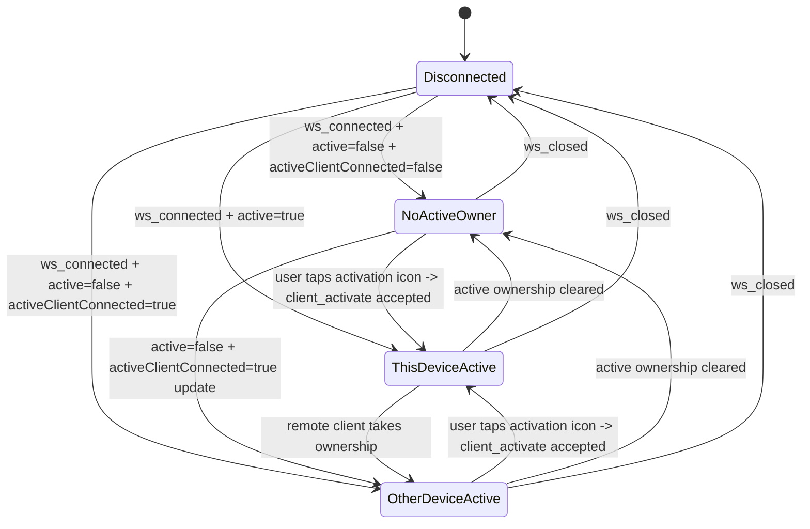
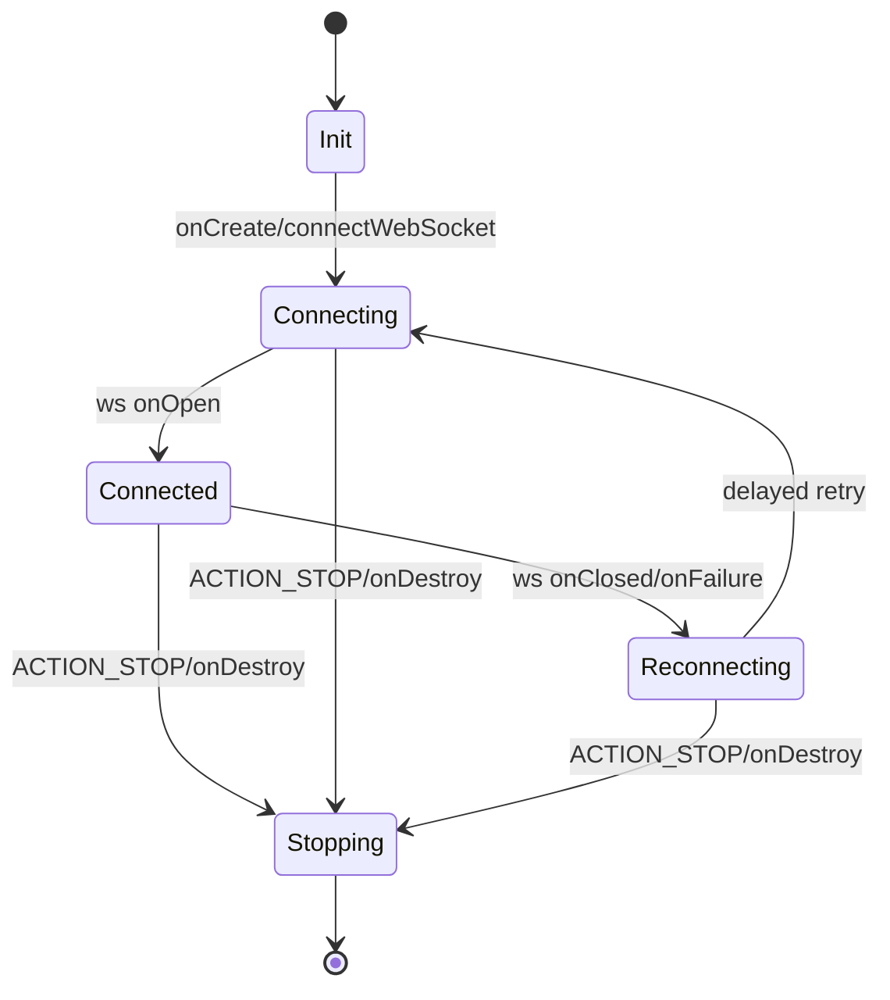
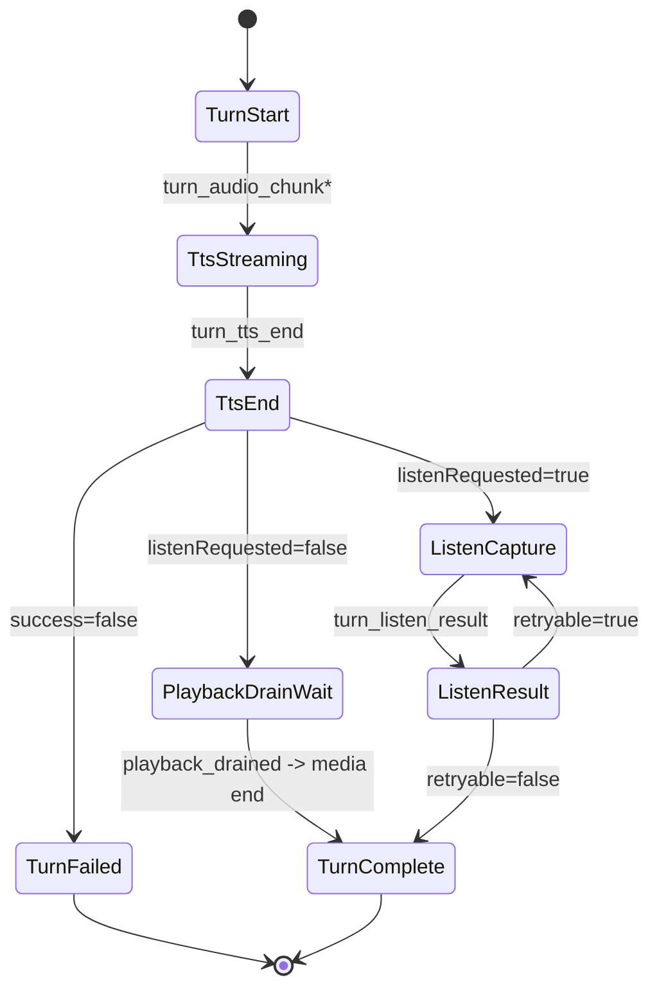
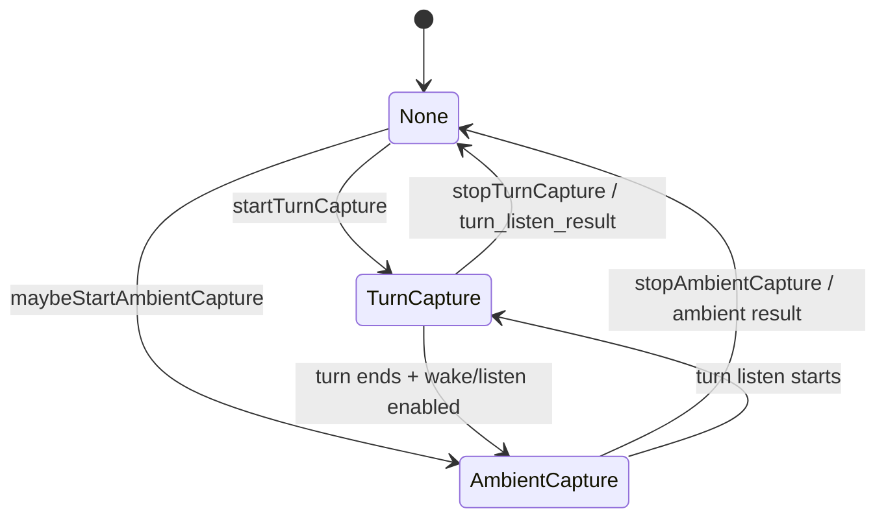
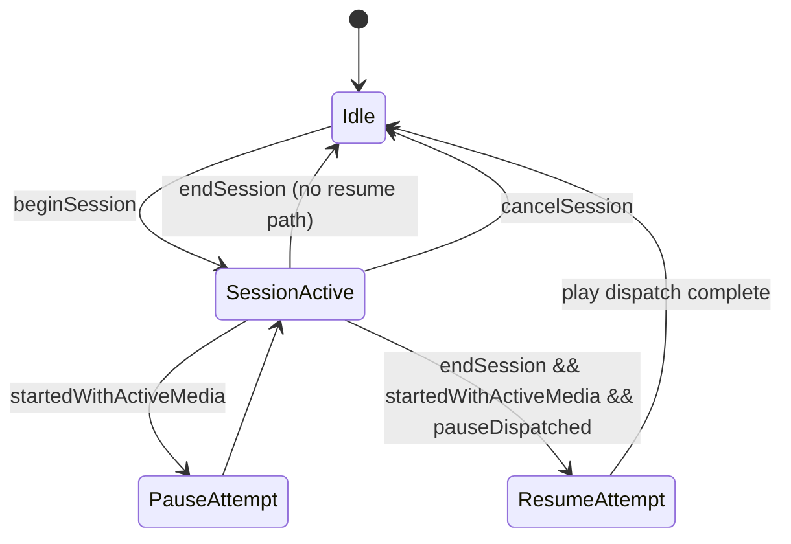
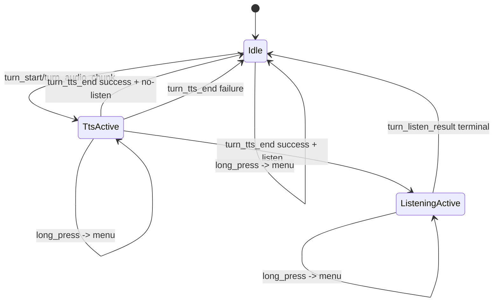

# Android Architecture and State Machine

This document describes the Android client runtime in technical detail, with explicit state machines and rationale for major design choices.

## Scope

Covers native Android code under `android/app/src/main/java/com/agentvoiceadapter/android`:

- `MainActivity`
- `VoiceAdapterService`
- `PcmAudioPlayer`
- `MicPcmStreamer`
- `ExternalMediaController`
- `CuePlayer`
- config/storage/helpers (`AdapterConfig`, `UrlUtils`, `BubbleHistoryStore`, `AudioDeviceUtils`)

## Design Goals

- Keep voice loop alive while app is backgrounded (foreground service + websocket).
- Preserve deterministic turn sequencing from server protocol.
- Keep state mutations race-safe by centralizing service state changes on main thread.
- Provide explicit observability (`cue_state`, `media_ctrl`, `ws_heartbeat_*` logs).
- Degrade safely when Android routing/focus/media APIs are inconsistent.

## Permissions and Platform Constraints

Manifest permissions are intentionally minimal for always-on voice behavior:

- `INTERNET`: websocket + HTTP turn/wake/session-dispatch traffic.
- `RECORD_AUDIO`: per-turn and ambient microphone capture.
- `MODIFY_AUDIO_SETTINGS`: route/focus/SCO coordination.
- `FOREGROUND_SERVICE`, `FOREGROUND_SERVICE_MICROPHONE`, `FOREGROUND_SERVICE_MEDIA_PLAYBACK`: stable background runtime for simultaneous playback/capture.
- `REQUEST_IGNORE_BATTERY_OPTIMIZATIONS`: user opt-out prompt for OEM battery killers.
- `POST_NOTIFICATIONS`: Android 13+ notification visibility for the foreground service.

Runtime implications:

- service is the source of truth for transport/capture state while UI is backgrounded
- activity can be killed/recreated without breaking active turn handling
- notification is required for process priority and long-lived socket reliability

## Component Model

- `MainActivity`
  - UI controls, settings persistence, bubble rendering, session-dispatch modal.
  - Optional always-visible bottom status strip driven by compact runtime-state events (`ws`, `audio`, `media`, `music` where `music` is captured as decision-point snapshots for media control logic).
  - Emits runtime config updates and service actions.
- `VoiceAdapterService`
  - Protocol/state orchestrator.
  - Owns websocket lifecycle, turn state, capture state, cue/media policy.
- `PcmAudioPlayer`
  - PCM chunk playback (`AudioTrack`) and audio-focus transitions.
  - Tracks playback drain signal for no-listen turn completion behavior.
- `MicPcmStreamer`
  - Streaming `AudioRecord` capture for turn listen and ambient wake.
- `ExternalMediaController`
  - Best-effort pause/resume for external media apps via media key events.
- `CuePlayer`
  - Notification-sound cues (wake + completion patterns).

## State Ownership and Concurrency

Primary rule: service state is main-thread-owned.

- `dispatchServerMessage` keeps a `turn_audio_chunk` fast path, but chunk ingestion now enqueues PCM into a bounded playback queue while a dedicated `PcmAudioPlayer` worker performs blocking `AudioTrack.write` calls; shared runtime-state mutation (`audio=playback`) is always re-entered on main via `runOnMain`.
- `turn_start` dispatch is synchronized to main-thread completion (`runOnMainAndWait`) before subsequent chunks are processed, so capture teardown completes before TTS playback begins.
- Explicit `assertMainThread(...)` guards are present on state-sensitive methods.
- `MicPcmStreamer` capture loop runs on a background thread and reports via callbacks; service transitions are re-entered on main thread.
- Mic capture lifecycle is now session-token scoped: each start gets a unique token, stop/finalize are token-matched, and `AudioRecord.read <= 0` exits the loop to avoid stale-thread spin.

This avoids cross-thread races among:

- active capture ids
- pending recognition sets/maps
- cue suppression/handling flags
- external media session id

Note: external media pause probing runs on a dedicated single-thread executor and re-enters service state updates on main thread, avoiding UI/main-thread stalls from pause-probe sleeps.

## Runtime Configuration State

`AdapterRuntimeConfig` fields:

- connectivity: `apiBaseUrl`
- turn behavior: `speechEnabled`, `listeningEnabled`, `wakeEnabled`
- routing/focus: `selectedMicDeviceId`, `continuousFocusEnabled`
- external media policy: `pauseExternalMediaEnabled`
- output gain: `ttsGain`
- cue gain: `recognitionCueGain`
  - mapped through a bounded nonlinear dB curve before PCM gain is applied
- playback startup pre-roll: `playbackStartupPrerollMs` (default `200`)

Persistence:

- `AdapterPrefs` (`SharedPreferences`) for runtime toggles.
- `BubbleHistoryStore` (`SharedPreferences`) capped to last `100` bubbles.

## Active-Client Ownership State Machine

When multiple widget clients are connected, server-side routing can be pinned to one active client.
Android exposes this through a top-right header activation icon (`check_circle_outline` when inactive,
`check_circle` when active) and tracks ownership with websocket status events.
The service also keeps a local `wantActive` intent flag so reconnects re-send `client_activate` until
ownership is explicitly released locally or lost to another device.

### Inputs

- outbound action: `client_activate` (sent when user taps the header activation icon)
- outbound action: `client_deactivate` (sent when active user taps the icon again)
- inbound updates:
  - `server_state.activeClientConnected`
  - `client_activation_state` (`active`, `activeClientConnected`, `connectedClients`)

### Local ownership states

- `Disconnected`: websocket not open
- `ThisDeviceActive`: this Android client currently owns routing
- `OtherDeviceActive`: another client owns routing
- `NoActiveOwner`: no explicit owner is selected, including the initial single-client connection state

Rationale:

- prevents ambiguous multi-client turn ownership
- keeps routing intent user-visible in Android UI
- allows explicit takeover without app restart or reconnect
- if ownership is lost mid-turn, Android now cancels the local turn and releases capture/playback resources
- deactivate/listen-disable now run a forced local capture release path (including unconditional recorder stop) so stale mic sessions are torn down even if turn tracking desyncs

## Service Lifecycle State Machine

### States

- `Init`: service created, notification started, config loaded.
- `Connecting`: websocket connect attempt in progress.
- `Connected`: socket open; client state sent.
- `Reconnecting`: retry delay active after close/failure.
- `Stopping`: teardown path; callbacks removed; resources released.

### Events and transitions

- `onCreate` -> `Connecting`
- socket `onOpen` -> `Connected`
- socket `onClosed`/`onFailure` -> `Reconnecting` (unless stopping)
- `ACTION_STOP` / `onDestroy` -> `Stopping`

### Heartbeat policy

Transport ping is disabled (`OkHttp pingInterval=0`).

Android runs an app-level idle `client_ping` probe loop:

- probes only in true idle state (no active turn/capture/pending-recognition)
- sends `client_ping` after idle threshold
- expects `server_pong` and records probe RTT/health counters
- re-validates idle state at probe-send time (stale-schedule guard)
- clears in-flight probes on real traffic/activity
- reconnects only after consecutive idle probe failures (not on first miss)

This keeps active turn flow protected from heartbeat churn while still recovering dead idle sockets.

## Turn State Machine (Service)

Per-turn tracking primitives:

- `turnListenModelById: Map<turnId, model?>`
- `pendingTurnRecognitionIds: Set<turnId>`
- `activeTurnCaptureId: turnId?`
- `handledRecognitionCueTurnIds: Set<turnId>`
- `suppressSuccessCueTurnIds: Set<turnId>`
- `activeExternalMediaTurnId: turnId?`

### Turn flow

1. `turn_start`
- prune old handled-cue cache
- enforce capture barrier first (`prepareForIncomingTurnPlayback`):
  - stop active turn/ambient/voice-to-agent capture
  - clear pending voice-to-agent result handoff state
  - release capture focus and stop residual playback buffers
- `beginExternalMediaSession(turnId)`
- render assistant bubble
- if `listenRequested`: store listen model, mark pending recognition, begin continuous focus reservation

2. `turn_audio_chunk`
- decode/play PCM chunk if speech enabled

3. `turn_tts_end`
- on failure: emit error bubble, clear listen bookkeeping, end media session
- on success + listen model present: stop playback and start turn capture
- on success + no listen model: schedule external media end after local playback drain

4. `turn_listen_result`
- ambient id path: render transcript, maybe wake intent call, restart ambient
- turn id path:
  - if `retryable`, restart capture
  - else finalize transcript/error bubble
  - end continuous reservation
  - end external media session
  - either skip success cue (when resume signal used) or play cue

## Server Event -> State Mutation Matrix

This maps each protocol event to the state that changes in `VoiceAdapterService`.

| Event | Primary State Mutations | Secondary Effects |
| --- | --- | --- |
| `turn_start` | allocates listen model entry, adds `pendingTurnRecognitionIds`, sets `activeExternalMediaTurnId` | clears stale playback, optional assistant bubble, optional continuous focus reservation |
| `turn_audio_chunk` | updates runtime audio state to `playback` (main-thread re-entry) | PCM decoded/written to `AudioTrack` |
| `turn_tts_end` success + listen | starts turn capture (`activeTurnCaptureId`) | ends TTS playback path, moves to recognition |
| `turn_tts_end` success + no-listen | none directly | schedules external-media end on local playback-drain callback |
| `turn_tts_end` failure | removes listen-model/pending-recognition entry for turn | emits failure bubble and ends media session |
| `turn_listen_stop` | clears active capture id when matching turn/ambient capture | emits stream end, recognition focus teardown |
| `turn_listen_result` ambient id | clears ambient capture id | optional wake-intent call, ambient restart schedule |
| `turn_listen_result` turn id retryable | keeps turn in pending set | emits retry bubble and re-arms capture |
| `turn_listen_result` turn id terminal | removes pending/model entries, marks cue handled/suppressed, clears media turn | emits transcript/error bubble, ends media session, cue-or-skip decision |

Invariants enforced by this model:

- only one active turn capture id at a time
- only one active ambient capture id at a time
- only one active external-media turn id at a time
- recognition success cue is at-most-once per turn id
- turn-level media session is ended exactly once (guarded by active turn id check)
- ambient capture start failures are retried with delayed restart while wake/listen remain enabled

## Capture Mode State Machine

### Modes

- `None`: no mic capture
- `TurnCapture(turnId)`
- `AmbientCapture(requestId)`

### Invariants

- ambient and turn capture are mutually exclusive
- ambient is blocked when turn capture active
- ambient auto-restarts after terminal ambient result when wake/listen remain enabled

## Audio Focus State Machine (`PcmAudioPlayer`)

Internal focus states:

- `NONE`
- `PLAYBACK` (`AUDIOFOCUS_GAIN_TRANSIENT`)
- `CAPTURE` (`AUDIOFOCUS_GAIN_TRANSIENT_EXCLUSIVE`)

### Behavior

- playback chunks request/retain playback focus
- recognition start transitions to capture focus
- recognition end returns to playback focus if continuous reservation is active
- focus duck/loss events stop or attenuate track

### Continuous reservation

Goal: avoid focus release gap between TTS and recognition startup in listen turns.

## Local Playback-Drain Signal (No-Listen Turns)

No-listen turns do not have a server-side recognition terminal event. Resume needs a local playback completion anchor.

Current mechanism:

- track cumulative frames written to `AudioTrack`
- set marker position to final written frame
- invoke callback on marker reached (`onPlaybackDrained`)
- keep bounded fallback timeout based on estimated remaining audio

Rationale:

- cleaner than pure timer-only end scheduling
- still robust when marker callback is unavailable or unreliable on a device

## External Media Control State Machine (`ExternalMediaController`)

### Session start

- sample `isMusicActive`
- if active, dispatch one immediate pause key event
- record `pauseDispatched`, `pausedByUs`, and decision-point snapshot state

### Session end

- dispatch one immediate resume (`PLAY`) only when media started active, pause was dispatched, and pause was confirmed (`pausedByUs=true`)

Rationale:

- Android media-session/app-op reporting is inconsistent by app/device
- start-state snapshot + immediate pause avoids long pause-probe windows that can overlap TTS playback
- sending `PLAY` after active-start + pause-dispatched is safer and effectively idempotent for already-active sessions

## Cue Policy

- recognition completion cues use `PcmAudioPlayer.playCueProbe` (same media path as TTS)
- wake cues use notification ringtone path (`CuePlayer`)
- optional startup pre-roll silence is prepended on first TTS chunk per turn and at cue start
- recognition cue policy is runtime-configurable:
  - `media_inactive_only` (default): suppress cues when turn started with external media active
  - `always`: always emit recognition cues
  - `off`: suppress all recognition cues

Rationale:

- probe cue on TTS path avoids delayed/muted notification-path behavior on some devices
- wake cues intentionally use Android notification usage so they follow system notification policy (including DND/profile handling)
- configurable suppression prevents overlapping "done" signals when media resume is intentional feedback while still allowing explicit always/off behavior

## Wake Intent Flow

Ambient transcript containing `agent|assistant`:

- emits user bubble
- POSTs to `/api/wake-intent`
- plays start/end wake cues around request
- emits result/failure bubble

## UI State Machine (`MainActivity`)

### Major UI modes

- settings collapsed/expanded
- foreground service on/off
- recognition indicator active/inactive
- session-dispatch dialog open/closed
- bubble interaction mode (tap behavior depends on active turn phase)
- active-client status refresh requested on foreground `onStart` when service is enabled (state snapshot re-sync)
- mic input selector refresh requested on foreground `onStart` and when settings are expanded

Service toggle persistence:

- `MainActivity` persists `Run foreground service` in local preferences.
- on app launch, startup behavior follows this saved toggle (default ON for first launch).

### Session-dispatch dialog states

- `LoadingSessions`
- `Ready(list + filter + selection)`
- `Sending`
- `Success` (auto-close)
- `Error`

### Turn bubble interaction state machine

The assistant bubble interaction surface is intentionally phase-aware:

- During TTS playback, single-tap maps to `Stop TTS` (`/api/turn/stop-tts`) to jump to listen ASAP.
- During TTS playback, the active assistant bubble outline pulses in both opacity and stroke width (without fading out completely) for quick visual "currently speaking" feedback.
- During recognition capture, single-tap maps to `Cancel turn` (`/api/turn/cancel`).
- Long-press always opens the action menu and shows both actions.

Rationale:

- keeps primary action one tap away without opening a modal during urgent phases
- preserves discoverability/explicitness through long-press menu
- reduces stuck-turn recovery friction for active recognition

### Server-settings panel states

- `Idle` (last loaded values shown)
- `Loading` (`GET /api/server-settings`)
- `Applying` (`PATCH /api/server-settings`)
- `Error` (validation/network/server failure shown in status line)

Selection/filter model:

- `allSessions`
- `filteredSessions`
- `selectedSessionId`

## Session-Dispatch Trust Boundary

The Android app never talks directly to Termstation. It talks to adapter endpoints:

- `GET /api/session-dispatch/sessions`
- `POST /api/session-dispatch/send`

Rationale:

- keeps provider credentials and auth mechanics server-side
- allows provider swaps (`none`, `termstation`, future providers) without Android changes
- centralizes policy: active-session filtering, resolved-title mapping, and send auditing

Current UI contract:

- session list filtering is local and real-time across `workspace` and `resolvedTitle`
- message mode is either `Continue voice` (canned handoff prompt) or custom free-form text
- dispatch sends directly from the dialog action, with inline status and auto-close on success

## Observability and Diagnostics

Log namespaces are intentionally structured:

- `cue_state ...` for cue/turn decisions
- `media_ctrl ...` for media pause/resume lifecycle
- `media_pause_...` for service-level media session integration
- `ws_heartbeat_...` for idle probe behavior and non-fatal timeout/send-fail diagnostics
- `runtime_state` UI events for bottom-strip status chips (`ws`, `audio`, `media`, `turnId`)

This enables timeline reconstruction from logcat without attaching debugger.

## Failure Modes and Recovery

- websocket failures: reconnect loop on close/failure callbacks
- mic startup failure: safe no-op + status events; no crash
- focus denial for cues: bounded retry before status warning
- playback-drain marker callback missed: bounded timeout fallback still ends media session
- malformed server payload: ignored safely
- service stop: cancels websocket/capture/media session and clears state sets

## Architectural Tradeoffs and Rationale

1. Foreground service + websocket instead of activity-bound session
- Needed for background continuity and predictable event handling.

2. Main-thread state mutation discipline
- Simpler correctness model than lock-heavy shared mutable state.

3. Best-effort media-key external control
- No universal cross-app API for deterministic pause/resume.

4. Playback-drained local signal + fallback timeout
- Event-first correctness with practical device-compat fallback.

5. Session-dispatch as server-proxy in Android
- Keeps credentials off device UI and centralizes provider auth/policy.

## Known Limitations

- External media state remains best-effort; OEM/media-app differences can still vary behavior.
- Cue audibility can differ by route/focus policy and device-specific audio stack behavior.
- Activity UI does not itself model all service internals; service logs remain source of truth for deep diagnostics.

## Suggested Future Hardening

- Add instrumentation around `onPlaybackDrained` marker callback vs fallback-path usage frequency.
- Add explicit service event for "playback drained" to make UI/proxy diagnostics clearer.
- Add optional per-app media session targeting when available (instead of global media key semantics).
- Add an integration test harness for Android log-sequence assertions (turn start -> tts end -> capture -> listen result -> media end).
